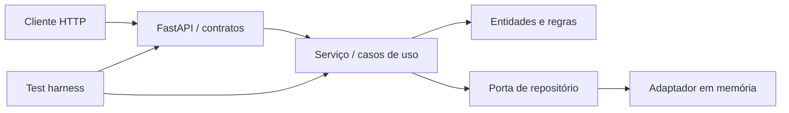

# CampusFlow

[](https://github.com/MorimFr/entrega-inicial/actions/workflows/ci.yml)

API para reservar salas de estudo compartilhadas sem conflitos de horário. Este repositório é a
Entrega 1 da disciplina e demonstra desenvolvimento orientado por especificação (SDD), colaboração
com IA, ambiente reproduzível e validação automatizada.

**Repositório público:** <https://github.com/MorimFr/entrega-inicial>

## Escopo da primeira iteração

- listar salas e capacidades;
- criar, consultar e cancelar reservas;
- impedir sobreposição de horários;
- limitar reservas a 2 horas e a 2 reservas ativas por usuário/dia;
- respeitar a capacidade da sala;
- consultar a disponibilidade de um intervalo.

A especificação completa, regras numeradas e contratos estão em
[`docs/SPECIFICATION.md`](docs/SPECIFICATION.md). A documentação interativa da API fica em
`http://localhost:8000/docs` durante a execução.

## Arquitetura



A divisão isola regras do framework e permite trocar a persistência em memória por banco de dados
sem alterar os casos de uso. A justificativa está no
[`ADR-001`](docs/adr/001-arquitetura-em-camadas.md).

## Instalação e execução local

Pré-requisito: Python 3.12.

No PowerShell:

```powershell
.\scripts\setup.ps1
.\.venv\Scripts\Activate.ps1
uvicorn campusflow.api:app --reload
```

Em Linux/macOS:

```bash
python -m venv .venv
source .venv/bin/activate
python -m pip install -e ".[dev]"
uvicorn campusflow.api:app --reload
```

Verificação rápida:

```bash
curl http://localhost:8000/health
curl http://localhost:8000/rooms
```

## Ambiente padronizado com Docker

Pré-requisito: Docker com Compose v2.

```bash
docker compose up --build api
```

A API será exposta em `http://localhost:8000`. Para encerrar, pressione `Ctrl+C` e execute
`docker compose down`.

## Test harness

Execução local completa (lint, testes unitários/de API e cobertura mínima de 90%):

```powershell
.\scripts\test.ps1
```

Ou diretamente:

```bash
python -m ruff check .
python -m pytest
```

Execução no ambiente padronizado:

```bash
docker compose --profile test run --rm tests
```

O `pytest` descobre a suíte em `tests/`, injeta um repositório novo em cada teste e falha se a
cobertura ficar abaixo de 90%. O pipeline `.github/workflows/ci.yml` repete lint e testes em cada PR
para `main`/`develop`, além de guardar `test-output.log` e `coverage.xml` como artefatos. O último log
local comprovado está em [`docs/evidence/test-run.md`](docs/evidence/test-run.md).

## Governança e colaboração

O fluxo adotado é:

```text
main (protegida) <- PR aprovado <- develop <- feature/<numero>-<descricao>
```

- `main`: versões estáveis; commits diretos devem ser bloqueados nas regras do GitHub.
- `develop`: integração da sprint.
- `feature/*`, `fix/*`, `docs/*`: uma Issue por unidade independente de trabalho.
- todo merge em `main` exige PR, CI verde e revisão autorizada; como a equipe é individual, a forma
  de aprovação pelo professor, monitor ou colaborador deve ser confirmada com o docente.
- o template de PR exige vínculo com Issue, critérios de aceitação e evidências.

As configurações que dependem da interface do GitHub estão descritas em
[`docs/GOVERNANCE.md`](docs/GOVERNANCE.md), e o backlog importável para GitHub Projects está em
[`docs/project-backlog.csv`](docs/project-backlog.csv). Templates de Issue e PR já acompanham o
repositório.

## Desenvolvimento colaborativo com IA

O Codex foi usado como agente auxiliar para decompor a especificação, gerar a estrutura inicial e
apoiar a criação de testes. `AGENTS.md` mantém o contexto SDD no próprio repositório: a convenção é
suportada pela [documentação oficial do Codex](https://learn.chatgpt.com/docs/agent-configuration/agents-md).
Prompts, limites de uso e protocolo de revisão humana estão em
[`docs/AI_USAGE.md`](docs/AI_USAGE.md). Código gerado por IA passa pelo mesmo PR, revisão e harness.

## Decisões arquiteturais (ADRs)

| ADR | Decisão | Estado |
|---|---|---|
| [001](docs/adr/001-arquitetura-em-camadas.md) | Domínio isolado e repositório em memória | Aceita |
| [002](docs/adr/002-api-e-testes.md) | FastAPI, Pytest e cobertura mínima | Aceita |

Mudanças da especificação motivadas por revisão/testes estão registradas em
[`docs/SPEC_CHANGELOG.md`](docs/SPEC_CHANGELOG.md).

## Relatório da Entrega 1

O relatório consolidado, com identificação, resumo técnico e nove evidências legíveis, está em
[`docs/ENTREGA_INICIAL_FINAL.pdf`](docs/ENTREGA_INICIAL_FINAL.pdf). Os arquivos-fonte e os PNGs
originais ficam em `docs/RELATORIO_FINAL.html` e `docs/evidence/screenshots/`.

## Estrutura do repositório

```text
campusflow/           aplicação e regras de negócio
tests/unit/           testes isolados do serviço
tests/api/            testes dos contratos HTTP
docs/                 especificação, ADRs, governança e evidências
.github/              CI e templates colaborativos
AGENTS.md              contexto persistente dos agentes de IA
Dockerfile/compose.yaml ambiente reproduzível
```

## Integrante

**Felipe Amorim Monteiro — RA 22452139.** Como a equipe é individual, as revisões foram realizadas
por um colaborador externo autorizado, mantendo autor e aprovador distintos nos PRs #10 e #11.

## Limitações conhecidas da iteração

- os dados ficam em memória e são perdidos ao reiniciar;
- autenticação e autorização ainda não fazem parte desta sprint;
- o catálogo inicial contém duas salas fixas;
- persistência SQL, autenticação institucional e interface web ficam para próximas iterações.

## Licença

Uso acadêmico. Consulte [`LICENSE`](LICENSE).
