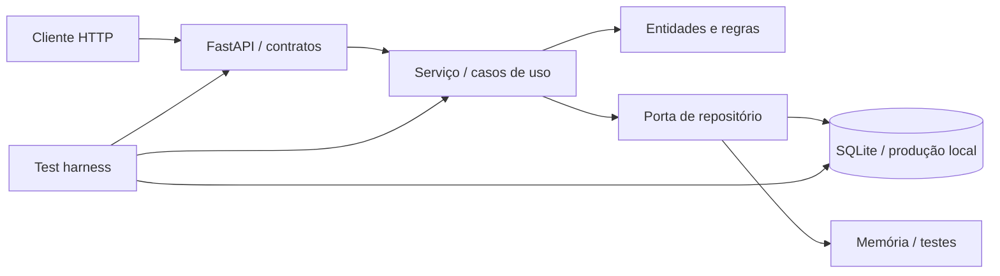

# CampusFlow

[](https://github.com/MorimFr/entrega-inicial/actions/workflows/ci.yml)

API persistente para reservar salas de estudo compartilhadas sem conflitos de horário. O mesmo
repositório acompanha as Entregas 1 e 2 da disciplina, preservando o ciclo de desenvolvimento
orientado por especificação (SDD), refinamentos por testes, colaboração com IA, governança e
validação automatizada.

**Repositório público:** <https://github.com/MorimFr/entrega-inicial>

## Solução funcional

- listar salas e capacidades;
- criar, consultar e cancelar reservas;
- impedir sobreposição e permitir intervalos adjacentes;
- limitar reservas a 2 horas e a 2 reservas ativas por usuário/dia;
- validar quantidade positiva e capacidade da sala;
- consultar disponibilidade;
- listar reservas de um usuário, com filtro por estado;
- preservar reservas e cancelamentos em SQLite após reiniciar a aplicação.

A especificação 0.3.0, regras numeradas e contratos estão em
[`docs/SPECIFICATION.md`](docs/SPECIFICATION.md). Com a API em execução, OpenAPI e Swagger ficam em
`http://localhost:8000/docs`.

## Arquitetura



A aplicação usa SQLite; o harness injeta memória nos testes unitários/HTTP e arquivos temporários
nos testes de integração. As decisões e trade-offs estão nos
[`ADR-001`](docs/adr/001-arquitetura-em-camadas.md),
[`ADR-002`](docs/adr/002-api-e-testes.md) e
[`ADR-003`](docs/adr/003-persistencia-sqlite.md).

## Instalação e execução local

Pré-requisito: Python 3.12.

No PowerShell:

```powershell
.\scripts\setup.ps1
.\.venv\Scripts\Activate.ps1
uvicorn campusflow.api:app --reload
```

Em Linux/macOS:

```bash
python -m venv .venv
source .venv/bin/activate
python -m pip install -e ".[dev]"
uvicorn campusflow.api:app --reload
```

O banco local padrão é `data/campusflow.db`, ignorado pelo Git. O caminho é configurável:

```powershell
$env:CAMPUSFLOW_DATABASE_PATH = "data/campusflow-local.db"
uvicorn campusflow.api:app --reload
```

Verificação rápida:

```bash
curl http://localhost:8000/health
curl http://localhost:8000/rooms
```

## Ambiente padronizado com Docker

Pré-requisito: Docker com Compose v2.

```bash
docker compose up --build api
```

A API fica em `http://localhost:8000`. O Compose monta o volume `campusflow-data` em `/app/data`,
portanto recriar o contêiner não apaga as reservas. Para encerrar:

```bash
docker compose down
```

## Test harness

Execução local completa:

```powershell
.\scripts\test.ps1
```

Ou diretamente:

```bash
python -m ruff check .
python -m pytest
```

Execução no ambiente padronizado:

```bash
docker compose --profile test run --rm --build tests
```

O Pytest descobre testes unitários, de contrato HTTP e de integração SQLite. Cada caso usa estado
isolado, todos devem passar e o processo falha se a cobertura ficar abaixo de 90%. O workflow
`.github/workflows/ci.yml` repete lint e testes nos PRs, guardando `test-output.log` e `coverage.xml`
como artefatos. Evidências ficam em [`docs/evidence/`](docs/evidence/).

## Refinamento orientado por testes

Na Sprint 2, um teste direto do serviço demonstrou que `attendees=0` e `attendees=-1` eram aceitos,
embora RN-03 exigisse inteiro positivo. A causa era a regra existir apenas no schema HTTP. O serviço
agora retorna `invalid_attendee_count`, e a versão 0.3.0 da especificação registra a mudança.

O relatório com falha observada, causa, correção e prevenção está em
[`docs/LOGICAL_ERRORS.md`](docs/LOGICAL_ERRORS.md). O histórico de re-especificação está em
[`docs/SPEC_CHANGELOG.md`](docs/SPEC_CHANGELOG.md).

## Governança e colaboração

```text
main (protegida) <- PR aprovado <- develop (protegida) <- feature/fix/docs
```

- `main`: versão estável; recebe a sprint por PR vindo de `develop`.
- `develop`: integração; recebe branches curtas vinculadas a Issues.
- todo merge protegido exige o check `quality`, branch atualizada, conversa resolvida e uma aprovação;
- a Sprint 2 está no marco **Entrega intermediária**, com Issues #13 a #19 atribuídas a Felipe;
- como a equipe é individual, um colaborador externo autorizado e diferente do autor realiza a
  aprovação; autoaprovação não é apresentada como revisão entre pares.

Processo, checklist e proteção estão em [`docs/GOVERNANCE.md`](docs/GOVERNANCE.md).

## Desenvolvimento com IA e análise crítica

O Codex foi usado para apoiar especificação, implementação, testes e documentação. `AGENTS.md`
mantém a fonte de verdade SDD, limites arquiteturais e gates no repositório. Código proposto pela IA
passa pelo mesmo diff, harness, PR e revisão humana.

- protocolo e prompts: [`docs/AI_USAGE.md`](docs/AI_USAGE.md);
- comparação entre Codex, Claude Code, Cursor e Antigravity, com análise de segurança, privacidade,
  propriedade intelectual e homologação humana: [`docs/AI_ETHICS.md`](docs/AI_ETHICS.md).

Somente o Codex foi utilizado no CampusFlow; as demais ferramentas foram avaliadas por documentação
oficial, sem alegação de ensaio prático inexistente.

## Decisões arquiteturais

| ADR | Decisão | Estado |
|---|---|---|
| [001](docs/adr/001-arquitetura-em-camadas.md) | Domínio isolado e porta de repositório | Aceita |
| [002](docs/adr/002-api-e-testes.md) | FastAPI, Pytest e gate de cobertura | Aceita |
| [003](docs/adr/003-persistencia-sqlite.md) | SQLite persistente atrás da porta | Aceita |

O relato da segunda iteração está em
[`docs/EXPERIENCE_REPORT.md`](docs/EXPERIENCE_REPORT.md), e o índice do futuro PDF em
[`docs/INTERMEDIATE_SUBMISSION.md`](docs/INTERMEDIATE_SUBMISSION.md).

## Relatório da Entrega 1

O relatório consolidado, com identificação, resumo técnico e nove evidências legíveis, está em
[`docs/ENTREGA_INICIAL_FINAL.pdf`](docs/ENTREGA_INICIAL_FINAL.pdf). Os arquivos-fonte e os PNGs
originais ficam em `docs/RELATORIO_FINAL.html` e `docs/evidence/screenshots/`.

## Estrutura do repositório

```text
campusflow/           aplicação, regras e adaptadores em memória/SQLite
tests/unit/           testes isolados do serviço
tests/api/            testes dos contratos HTTP
tests/integration/    testes de persistência e reinício
docs/                 especificação, ADRs, análises e evidências
.github/              CI e templates colaborativos
AGENTS.md             contexto persistente do agente de IA
Dockerfile/compose.yaml ambiente reproduzível e volume persistente
```

## Integrante

**Felipe Amorim Monteiro — RA 22452139.**

## Limitações conhecidas

- `user_id` é informado pelo cliente; autenticação e autorização ainda não fazem parte desta etapa;
- o catálogo inicial contém duas salas fixas;
- SQLite atende a implantação local de instância única, não concorrência distribuída;
- cadastro de salas, autenticação institucional e interface web ficam para próximas iterações.

## Licença

Uso acadêmico. Consulte [`LICENSE`](LICENSE).
